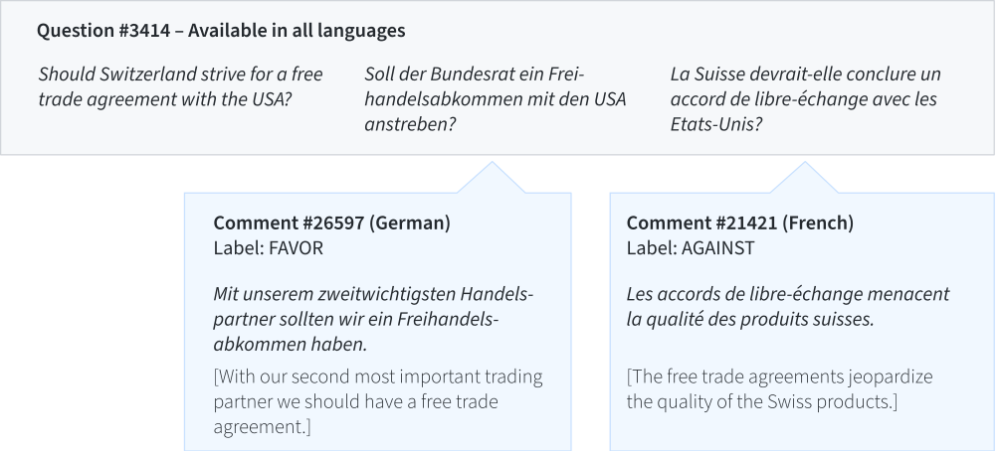

[](https://travis-ci.org/ZurichNLP/xstance)

# <span style="font-variant:small-caps;">x</span>-stance

Data and code accompanying the paper ["X-Stance: A Multilingual Multi-Target Dataset for Stance Detection"](http://ceur-ws.org/Vol-2624/paper9.pdf).

A high-level description can be found in the [**blog post**](https://vamvas.ch/more-general-stance-detection-with-x-stance), and a more detailed description in the [**paper**](http://ceur-ws.org/Vol-2624/paper9.pdf).


## Summary

The <span style="font-variant:small-caps;">x</span>-stance dataset contains more than **150 political questions**, and **67k comments** written by candidates on those questions.

It can be used to train and evaluate stance detection systems.

The comments are partly **German**, partly **French** and **Italian**. The questions are available in all the three languages plus **English**.

The data have been extracted from the Swiss voting advice platform [Smartvote](https://smartvote.ch/).

Data example:



## Structure

The dataset contains the following files:
- *train.jsonl*
- *valid.jsonl*
- *test.jsonl*
- *questions.{en,de,fr,it}.jsonl*

Example for a train, valid or test instance:

```json
{
   "id": 20475,
   "language": "de",
   "question_id": 3469,
   "question": "Soll der Bundesrat ein Freihandelsabkommen mit den USA anstreben?",
   "comment": "Nicht unter einem Präsidenten, welcher die Rechte anderer mit Füssen tritt und Respektlos gegenüber ändern ist.",
   "label": "AGAINST",
   "numerical_label": 0,
   "author": "8aa829c3b86f",
   "topic": "Foreign Policy",
   "test_set": "new_comments_defr"
}
```

Details:
- Languages: The files *train.jsonl* and *valid.jsonl* contain about 75% German data and 25% French data. The file *test.jsonl* also contains some Italians samples to test zero-shot cross-lingual transfer.
- `"label"` can be `"FAVOR"` or `"AGAINST"`.
- `"numerical_label"` provides a more fine-grained label (not used in our baseline). Range of values: {0, 25, 75, 100}, where 0 means "no" and 100 means "yes".
- `"test_set"`: Only *test.jsonl* has this field. Specifies the test partition (new comments / new questions / new topics; German+French / Italian). For details on the test partitions please refer to Table 2 in the [paper](http://ceur-ws.org/Vol-2624/paper9.pdf).

In the train, valid and test files, the comments are paired with a version of the question in the same language (e.g. German comment + German version of the question). The *questions.xx.jsonl* files provide complete translations of all the questions.

## Evaluation

Dependencies: Python 3; `scikit-learn`

Unpacking the data:
```bash
unzip data/xstance-data-v1.0.zip -d data
```

Usage:
```bash
python evaluate.py \
  --gold data/test.jsonl \
  --pred predictions/mbert_pred.jsonl 
```

The predictions file should be a JSON lines file (http://jsonlines.org/). The lines in the file should correspond to the lines in the gold file (*test.jsonl*).

Example prediction:
```json
{"label": "AGAINST"}
```

The evaluation script outputs the macro-average of the F1 score for each label, per test partition and per language:

```
new_comments_defr
DE 76.83541377429334
FR 76.61281705054353

new_questions_defr
DE 68.46881591336131
FR 68.3831150794995

new_topics_defr
DE 68.90323152487849
FR 70.8982523359103

new_comments_it
IT 70.19234360410832
```

## fastText Baseline
Dependencies:
- Python >= 3.6
- Perl
- `pip install -r fasttext_baseline/requirements.txt`

Unpacking the data (if not done in the previous section):
```bash
unzip data/xstance-data-v1.0.zip -d data
```

Downloading the Europarl preprocessing tools:
```bash
cd fasttext_baseline
wget http://www.statmt.org/europarl/v7/tools.tgz
tar -xvf tools.tgz
```

Training and predicting:
```bash
python run.py --data-dir ../data --pred ../predictions/mypred.jsonl
```

Evaluating:
```bash
cd ..
python evaluate.py \
  --gold data/test.jsonl \
  --pred predictions/mypred.jsonl 
```


## M-BERT Baseline
Dependencies:
- Python >= 3.6
- AllenNLP 0.9.0 (http://docs.allennlp.org/master/)
- `pip install -r mbert_baseline/requirements.txt`
- The commands below assume GPU computation. They can be adapted for CPU, however.

Unpacking the data (if not done in the previous section):
```bash
unzip data/xstance-data-v1.0.zip -d data
```

Training:
```bash
cd mbert_baseline
allennlp train mbert.jsonnet \
    --include-package allennlp_xstance \
    -s mymodel
```

Predicting:
```bash
cd mbert_baseline
allennlp predict mymodel ../data/test.jsonl \
    --include-package allennlp_xstance \
    --predictor xstance_predictor \
    --cuda-device 0 \
    --output-file ../predictions/mypred.jsonl
```

Evaluating:
```bash
cd ..
python evaluate.py \
  --gold data/test.jsonl \
  --pred predictions/mypred.jsonl 
```


## Licenses
- Dataset: CC BY-NC 4.0 (© www.smartvote.ch)
- Rest of repository: MIT License

## References
The dataset and baseline model are described in:

```bibtex
@inproceedings{vamvas2020xstance,
    author    = "Vamvas, Jannis and Sennrich, Rico",
    title     = "{X-Stance}: A Multilingual Multi-Target Dataset for Stance Detection",
    booktitle = "Proceedings of the 5th Swiss Text Analytics Conference (SwissText) \& 16th Conference on Natural Language Processing (KONVENS)",
    address   = "Zurich, Switzerland",
    year      = "2020",
    month     = "jun",
    url       = "http://ceur-ws.org/Vol-2624/paper9.pdf"
}
```

## Metadata
The metadata are used by search engines such as Google Dataset Search.
<div itemscope itemtype="http://schema.org/Dataset">
    <table>
        <tr>
            <th>property</th>
            <th>value</th>
        </tr>
        <tr>
            <td>name</td>
            <td><code itemprop="name"><span style="font-variant:small-caps;">x</span>-Stance: A Multilingual
                Multi-Target Dataset for Stance Detection</code></td>
        </tr>
        <tr>
            <td>description</td>
            <td><code itemprop="description">The <span style="font-variant:small-caps;">x</span>-stance dataset contains
                more than 150 political questions, and 67k comments written by candidates on those questions. It can be
                used to train and evaluate stance detection systems. The comments are partly German, partly French and
                Italian. The questions are available in all the three languages plus English. The data have been
                extracted from the Swiss voting advice platform Smartvote.ch.</code></td>
        </tr>
        <tr>
            <td>url</td>
            <td><code itemprop="url">https://github.com/ZurichNLP/xstance</code></td>
        </tr>
        <tr>
            <td>sameAs</td>
            <td><code itemprop="sameAs">https://doi.org/10.5281/zenodo.3831317</code></td>
        </tr>
        <tr>
            <td>license</td>
            <td>
                <div itemscope itemtype="http://schema.org/CreativeWork" itemprop="license">
                    <table>
                        <tr>
                            <th>property</th>
                            <th>value</th>
                        </tr>
                        <tr>
                            <td>name</td>
                            <td><code itemprop="name">CC BY-NC 4.0</code></td>
                        </tr>
                        <tr>
                            <td>url</td>
                            <td><code itemprop="url">https://creativecommons.org/licenses/by-nc/4.0/</code></td>
                        </tr>
                    </table>
                </div>
            </td>
        </tr>
        <tr>
            <td>distribution</td>
            <td>
                <div itemscope itemtype="http://schema.org/DataDownload" itemprop="distribution">
                    <table>
                        <tr>
                            <th>property</th>
                            <th>value</th>
                        </tr>
                        <tr>
                            <td>contentUrl</td>
                            <td><code itemprop="contentUrl">https://raw.githubusercontent.com/ZurichNLP/xstance/master/data/xstance-data-v1.0.zip</code>
                            </td>
                        </tr>
                        <tr>
                            <td>encodingFormat</td>
                            <td><code itemprop="encodingFormat">application/zip</code>
                            </td>
                        </tr>
                    </table>
                </div>
            </td>
        </tr>
        <tr>
            <td>citation</td>
            <td><code itemprop="citation">http://doi.org/10.5281/zenodo.3831317</code></td>
        </tr>
    </table>
</div>
